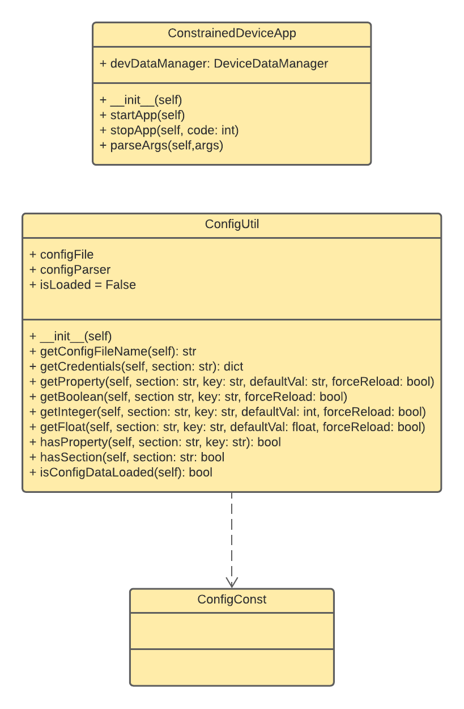

# Constrained Device Application (Connected Devices)

## Lab Module 01

Be sure to implement all the PIOT-CDA-* issues (requirements) listed at [PIOT-INF-01-001 - Chapter 01](https://github.com/orgs/programming-the-iot/projects/1#column-9974937).

### Description

Module01:Constrained Device Application is used to check if CDA development environment was built successfully and to help us practice using GitHub Classroom and git commands to manage repositories and branches. The implementation showed the structure of CDA projects with the project from repository. 

The implementation contains following steps:
1. Install eclipse and python3 environment.
2. Clone online repository from GitHub Classroom and install virtualenv environment.
3. Import the project and create a new branch.
4. Run unit tests and integration tests.(From ConfigUtilTest.py and ConstrainedDeviceAppTest.py)
5. Observe the result of tests.
6. Merge 2 branched and push to online repository. 

### Code Repository and Branch

URL: https://github.com/NU-CSYE6530-Fall2020/constrained-device-app-Zhengrui-Liu/tree/chapter01

### UML Design Diagram(s)

### Unit Tests Executed

- piot-python-components/src/test/python/programmingtheiot/part01/unit/common/ConfigUtilTest.py

### Integration Tests Executed

- piot-python-components/src/test/python/programmingtheiot/part01/integration/app/ConstrainedDeviceAppTest.py

