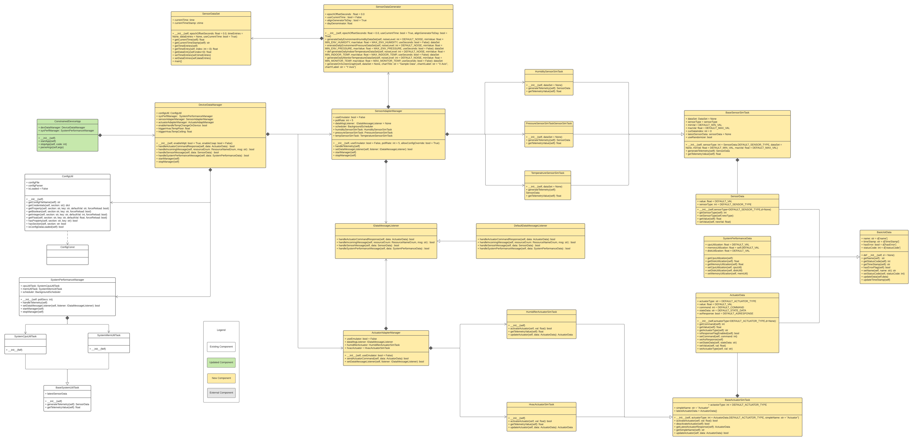

# Constrained Device Application (Connected Devices)

## Lab Module 03

Be sure to implement all the PIOT-CDA-* issues (requirements) listed at [PIOT-INF-03-001 - Chapter 03](https://github.com/orgs/programming-the-iot/projects/1#column-10488379).

### Description

Build different type of simulation tasks of sensors and actuators. Generate dataSet to simulate a senceHat. Implemented the sensor and actuator data management part of the project and connected the the part with CDA.

- Create data type of both actuator and sensor.
- Create base simulation task of sensors.
- Build simulation task of 3 types of sensors based on base simulation.
- Create base simulation task of actuators.
- Build simulation task of 2 types of actuators based on base simulation.
- Create and implement sensor/actuator adapter manager.
- Create device data manager with sensor/actuator adapter manager and system performance manager in it.
- Instantiate the device data manager with CDA. 

### Code Repository and Branch

URL: https://github.com/NU-CSYE6530-Fall2020/constrained-device-app-Zhengrui-Liu/tree/chapter03

### UML Design Diagram(s)

### Unit Tests Executed

- piot-python-components/src/test/python/programmingtheiot/part01/unit/common/ConfigUtilTest.py
- poit-python-components/src/test/python/programmingtheiot/part01/unit/system/SystemCpuUtilTaskTest.py
- poit-python-components/src/test/python/programmingtheiot/part01/unit/system/SystemMemUtilTaskTest.py
- poit-python-components/src/test/python/programmingtheiot/part02/unit/data/ActuatorDataTest.py
- poit-python-components/src/test/python/programmingtheiot/part02/unit/data/SensorDataTest.py
- poit-python-components/src/test/python/programmingtheiot/part02/unit/data/SystemPerformanceDataTest.py
- poit-python-components/src/test/python/programmingtheiot/part02/unit/sim/HumidifierActuatorSimTaskTest.py
- poit-python-components/src/test/python/programmingtheiot/part02/unit/sim/HumidifierSensorSimTaskTest.py
- poit-python-components/src/test/python/programmingtheiot/part02/unit/sim/HvacActuatorSimTaskTest.py
- poit-python-components/src/test/python/programmingtheiot/part02/unit/sim/PressureSensorSimTaskTest.py
- poit-python-components/src/test/python/programmingtheiot/part02/unit/sim/TemperatureSeneorSimTaskTest.py

### Integration Tests Executed

- poit-python-components/src/test/python/programmingtheiot/part01/integration/app/ConstrainedDeviceAppTest.py
- poit-python-components/src/test/python/programmingtheiot/part01/integration/system/SystemPerformanceManagerTest.py
- poit-python-components/src/test/python/programmingtheiot/part02/integration/app/DeviceDataManagerNoCommsTest.py
- poit-python-components/src/test/python/programmingtheiot/part02/integration/system/ActuatorAdapterManagerTest.py
- poit-python-components/src/test/python/programmingtheiot/part02/integration/system/SensorAdapterManagerTest.py
