# Constrained Device Application (Connected Devices)

## Lab Module 06

Be sure to implement all the PIOT-CDA-* issues (requirements) listed at [PIOT-INF-06-001 - Chapter 06](https://github.com/orgs/programming-the-iot/projects/1#column-10488379).

### Description

Implemented mqtt functions

1.Implemented publish,subscribe and unsubscribe functions.
2.Inplemented a simple version of callback functions.
3.Connected mqttClientConnector with DDM.

### Code Repository and Branch

URL: https://github.com/NU-CSYE6530-Fall2020/constrained-device-app-Zhengrui-Liu/tree/chapter06

### UML Design Diagram(s)

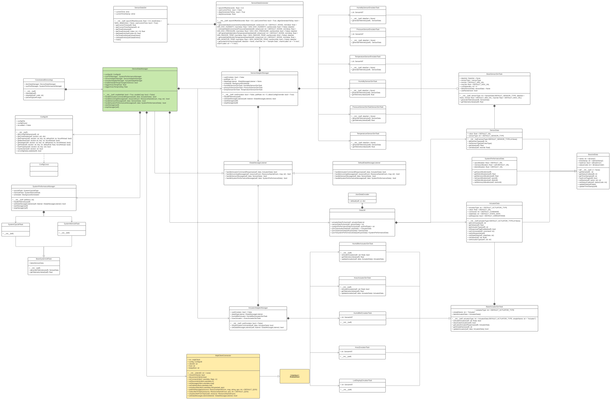

### Unit Tests Executed

- piot-python-components/src/test/python/programmingtheiot/part01/unit/common/ConfigUtilTest.py
- poit-python-components/src/test/python/programmingtheiot/part01/unit/system/SystemCpuUtilTaskTest.py
- poit-python-components/src/test/python/programmingtheiot/part01/unit/system/SystemMemUtilTaskTest.py
- poit-python-components/src/test/python/programmingtheiot/part02/unit/data/ActuatorDataTest.py
- poit-python-components/src/test/python/programmingtheiot/part02/unit/data/SensorDataTest.py
- poit-python-components/src/test/python/programmingtheiot/part02/unit/data/SystemPerformanceDataTest.py
- poit-python-components/src/test/python/programmingtheiot/part02/unit/sim/HumidifierActuatorSimTaskTest.py
- poit-python-components/src/test/python/programmingtheiot/part02/unit/sim/HumidifierSensorSimTaskTest.py
- poit-python-components/src/test/python/programmingtheiot/part02/unit/sim/HvacActuatorSimTaskTest.py
- poit-python-components/src/test/python/programmingtheiot/part02/unit/sim/PressureSensorSimTaskTest.py
- poit-python-components/src/test/python/programmingtheiot/part02/unit/sim/TemperatureSeneorSimTaskTest.py
- poit-python-components/src/test/python/programmingtheiot/part02/unit/data/DataUtilTest

### Integration Tests Executed

- poit-python-components/src/test/python/programmingtheiot/part01/integration/app/ConstrainedDeviceAppTest.py
- poit-python-components/src/test/python/programmingtheiot/part01/integration/system/SystemPerformanceManagerTest.py
- poit-python-components/src/test/python/programmingtheiot/part02/integration/app/DeviceDataManagerNoCommsTest.py
- poit-python-components/src/test/python/programmingtheiot/part02/integration/system/ActuatorAdapterManagerTest.py
- poit-python-components/src/test/python/programmingtheiot/part02/integration/system/SensorAdapterManagerTest.py
- poit-python-components/src/test/python/programmingtheiot/part02/integration/emulated/all
- poit-python-components/src/test/python/programmingtheiot/part03/integration/data/DataIntegrationTest
- poit-python-components/src/test/python/programmingtheiot/part03/integration/connection/MqttClientConnectorTest.py

### MQTT 14 Control Packets (QoS 1 and 2)

CONNECT

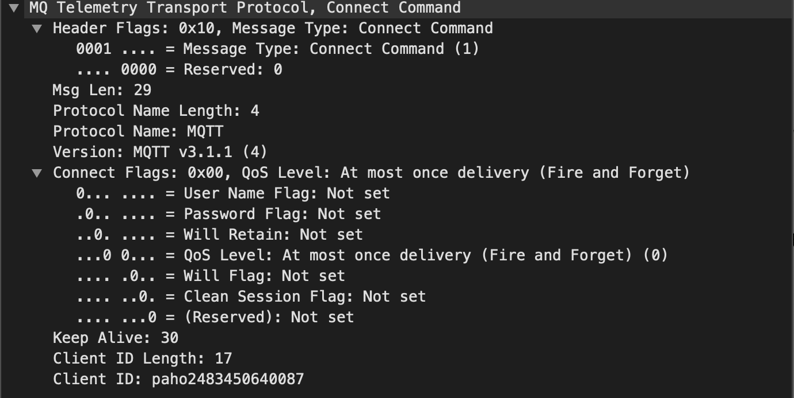

CONNACK

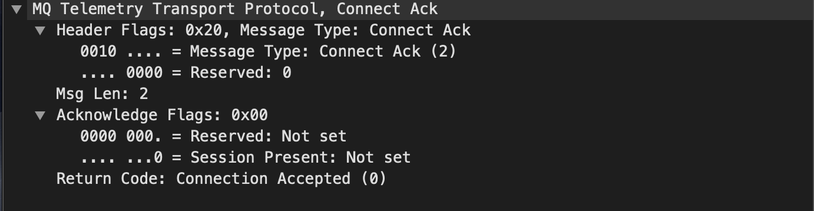

PUBLISH

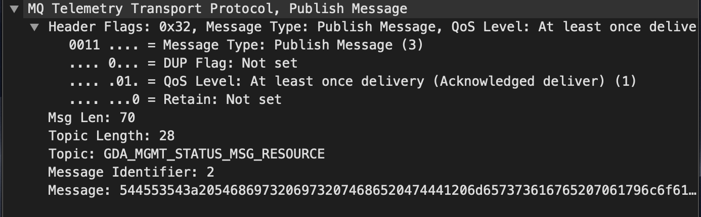

PUBACK(QoS1 only)

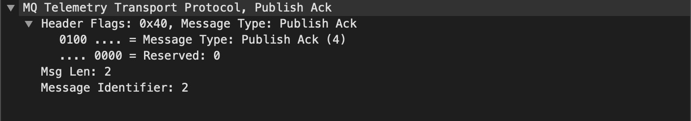

PUBREC(QoS2 only)

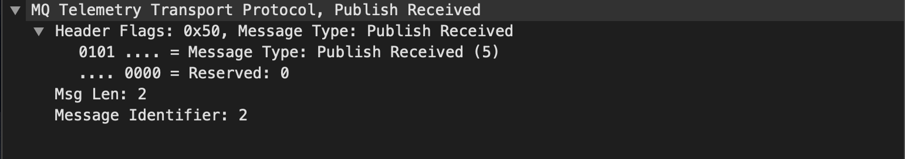

PUBREL(QoS2 only)

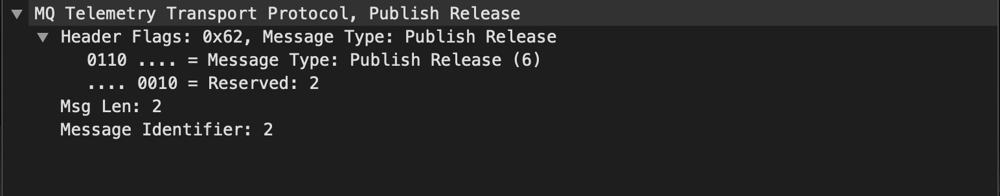

PUBCOMP(QoS2 only)

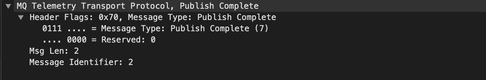

SUBSCRIBE

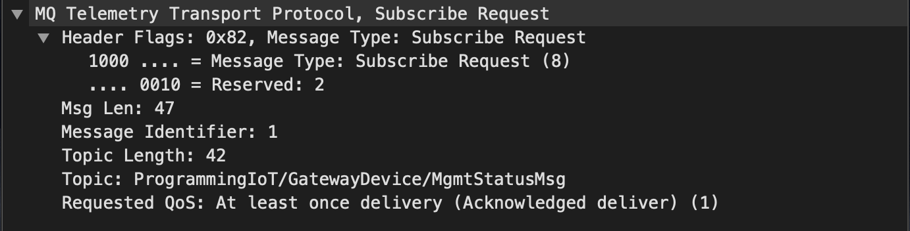

SUBACK

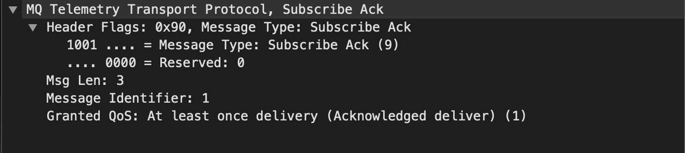

UNSUBSCRIBE

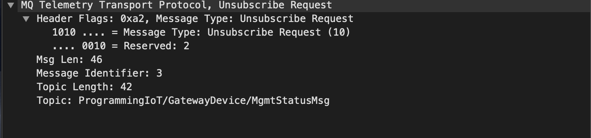

UNSUBACK

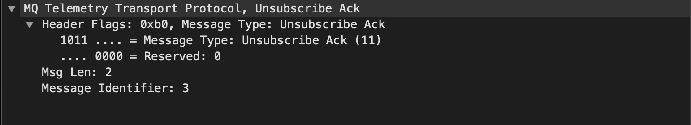

PINGREQ

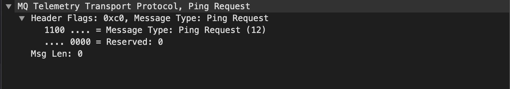

PINGRESP

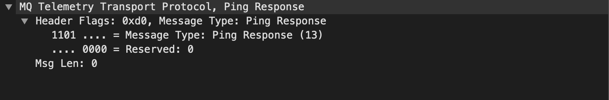

DISCONNECT

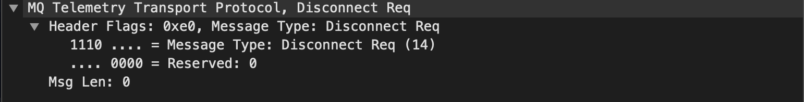

