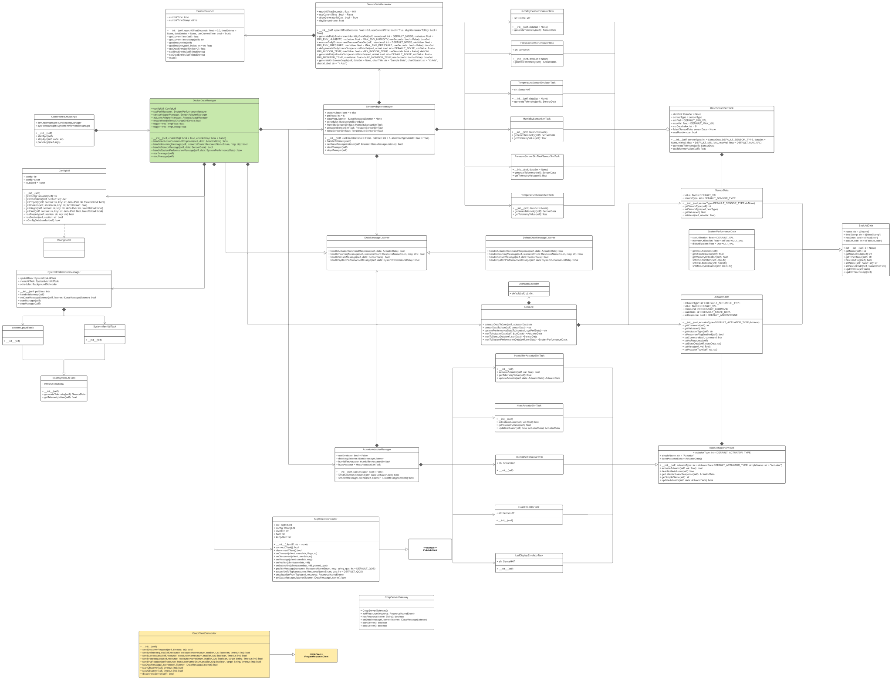
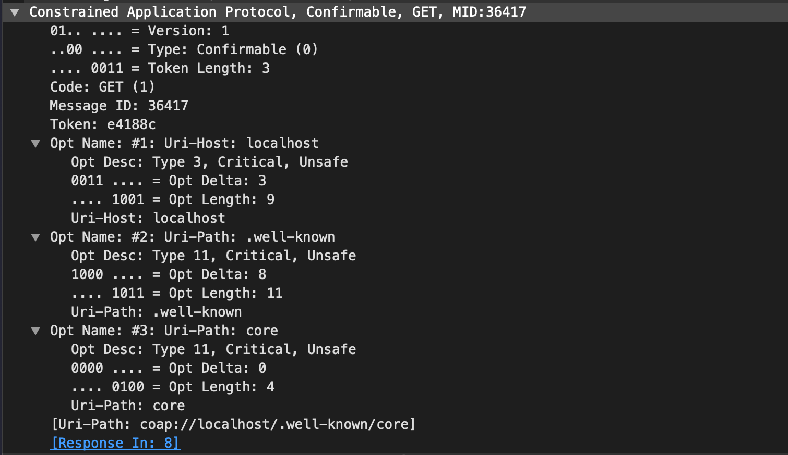
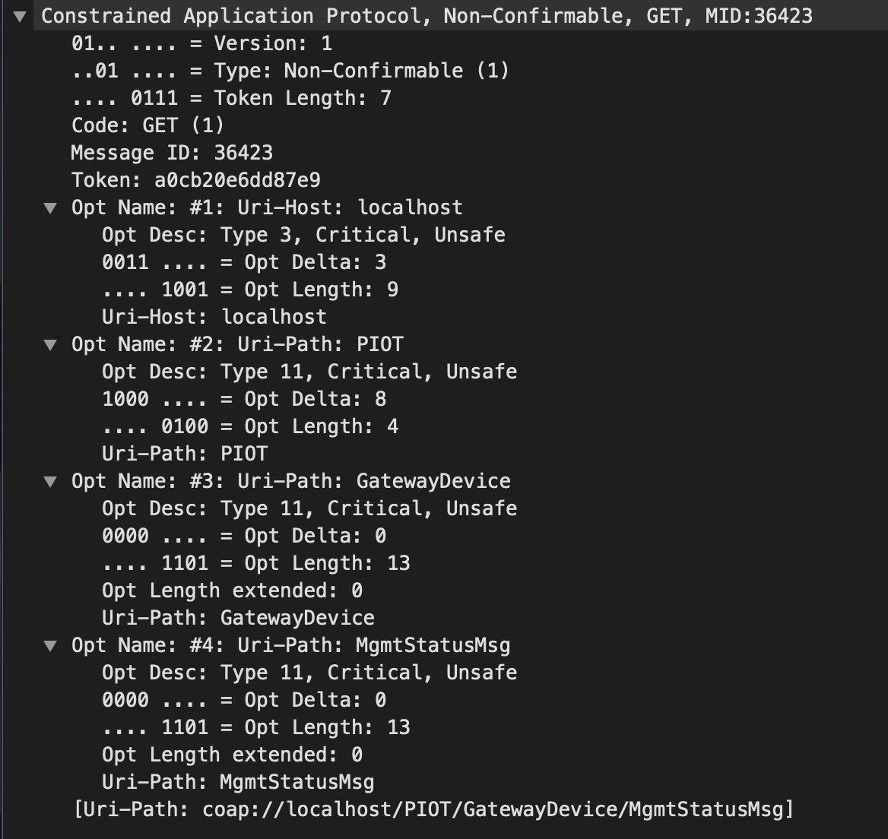
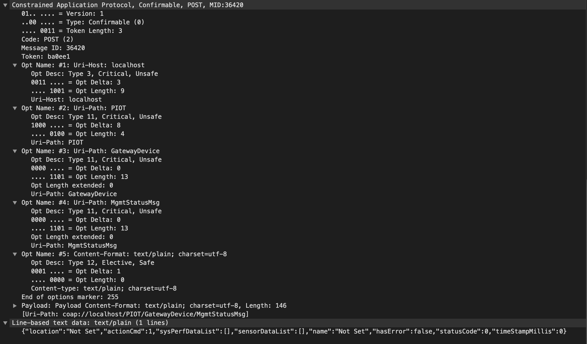
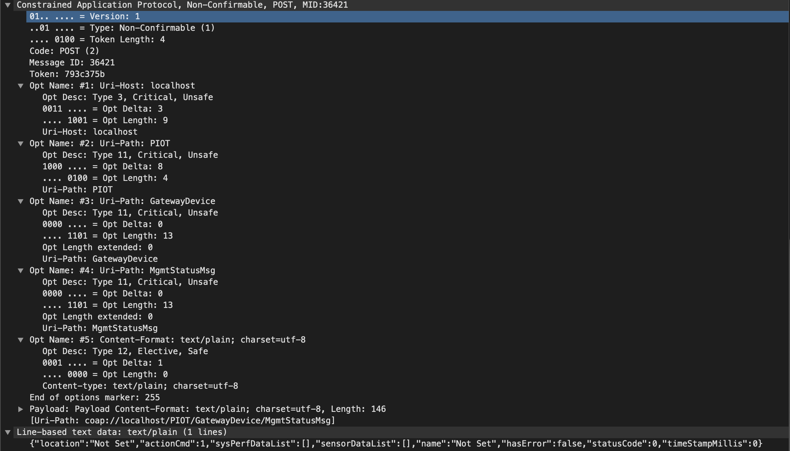
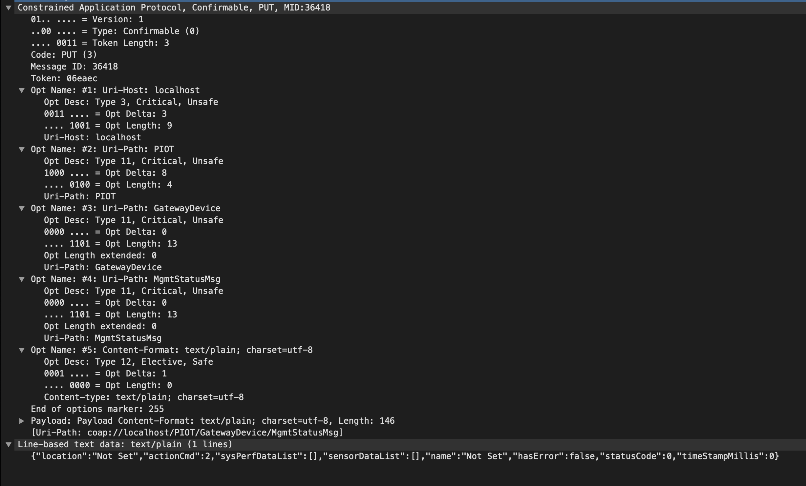
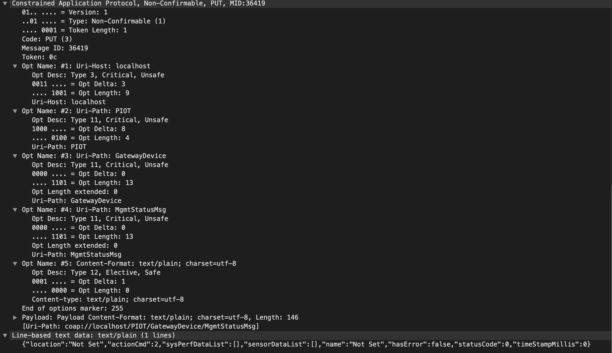
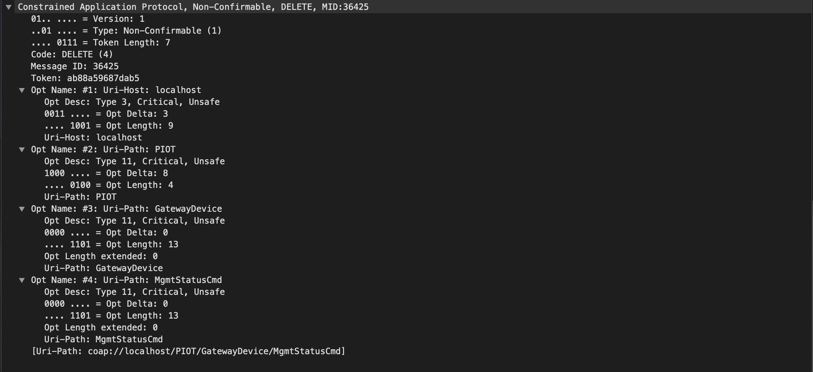
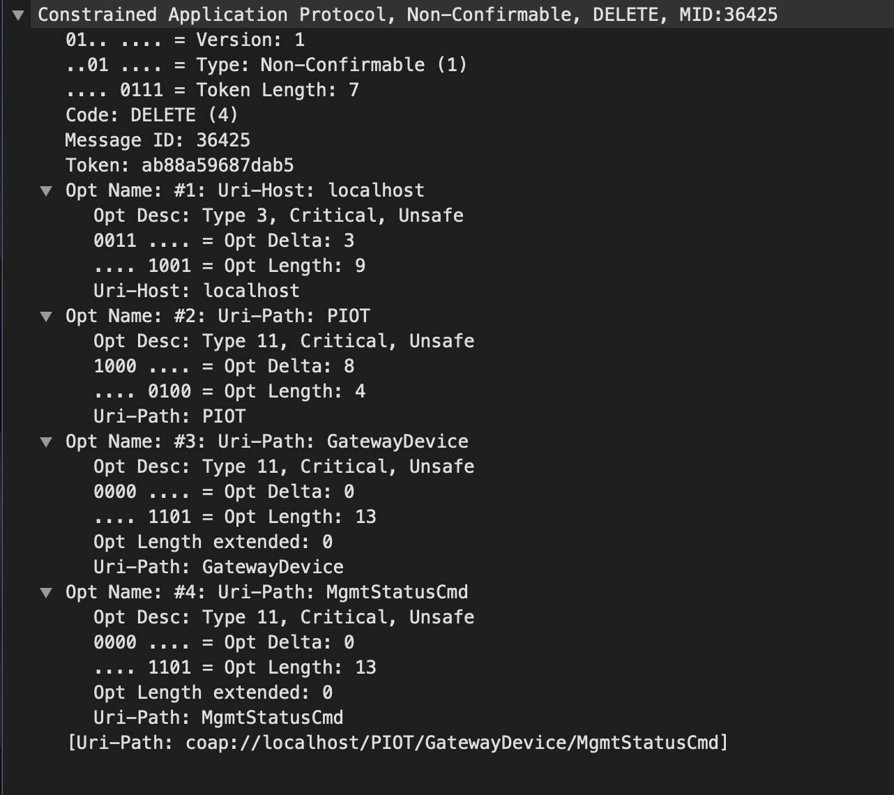

# Constrained Device Application (Connected Devices)

## Lab Module 09

### Description

Implemented CoAP functions

1. Implemented the CoAP Client as well as some call back functions.

### Code Repository and Branch

URL: https://github.com/NU-CSYE6530-Fall2020/constrained-device-app-Zhengrui-Liu/tree/chapter09

### UML Design Diagram(s)

### Unit Tests Executed

- piot-python-components/src/test/python/programmingtheiot/part01/unit/common/ConfigUtilTest.py
- poit-python-components/src/test/python/programmingtheiot/part01/unit/system/SystemCpuUtilTaskTest.py
- poit-python-components/src/test/python/programmingtheiot/part01/unit/system/SystemMemUtilTaskTest.py
- poit-python-components/src/test/python/programmingtheiot/part02/unit/data/ActuatorDataTest.py
- poit-python-components/src/test/python/programmingtheiot/part02/unit/data/SensorDataTest.py
- poit-python-components/src/test/python/programmingtheiot/part02/unit/data/SystemPerformanceDataTest.py
- poit-python-components/src/test/python/programmingtheiot/part02/unit/sim/HumidifierActuatorSimTaskTest.py
- poit-python-components/src/test/python/programmingtheiot/part02/unit/sim/HumidifierSensorSimTaskTest.py
- poit-python-components/src/test/python/programmingtheiot/part02/unit/sim/HvacActuatorSimTaskTest.py
- poit-python-components/src/test/python/programmingtheiot/part02/unit/sim/PressureSensorSimTaskTest.py
- poit-python-components/src/test/python/programmingtheiot/part02/unit/sim/TemperatureSeneorSimTaskTest.py
- poit-python-components/src/test/python/programmingtheiot/part02/unit/data/DataUtilTest

### Integration Tests Executed

- poit-python-components/src/test/python/programmingtheiot/part01/integration/app/ConstrainedDeviceAppTest.py
- poit-python-components/src/test/python/programmingtheiot/part01/integration/system/SystemPerformanceManagerTest.py
- poit-python-components/src/test/python/programmingtheiot/part02/integration/app/DeviceDataManagerNoCommsTest.py
- poit-python-components/src/test/python/programmingtheiot/part02/integration/system/ActuatorAdapterManagerTest.py
- poit-python-components/src/test/python/programmingtheiot/part02/integration/system/SensorAdapterManagerTest.py
- poit-python-components/src/test/python/programmingtheiot/part02/integration/emulated/all
- poit-python-components/src/test/python/programmingtheiot/part03/integration/data/DataIntegrationTest
- poit-python-components/src/test/python/programmingtheiot/part03/integration/connection/MqttClientConnectorTest.py
- poit-python-components/src/test/python/programmingtheiot/part03/integration/connection/CoapClientConnectorTest.py

### CoAP message captured

##### GET-CON

##### GET-NON

##### POST-CON

##### POST-NON

##### PUT-CON

##### PUT-NON

##### DELETE-CON

##### DELETE-NON

