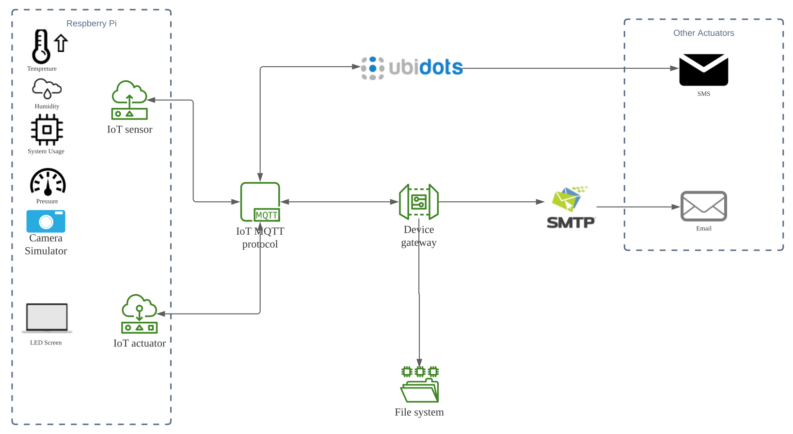
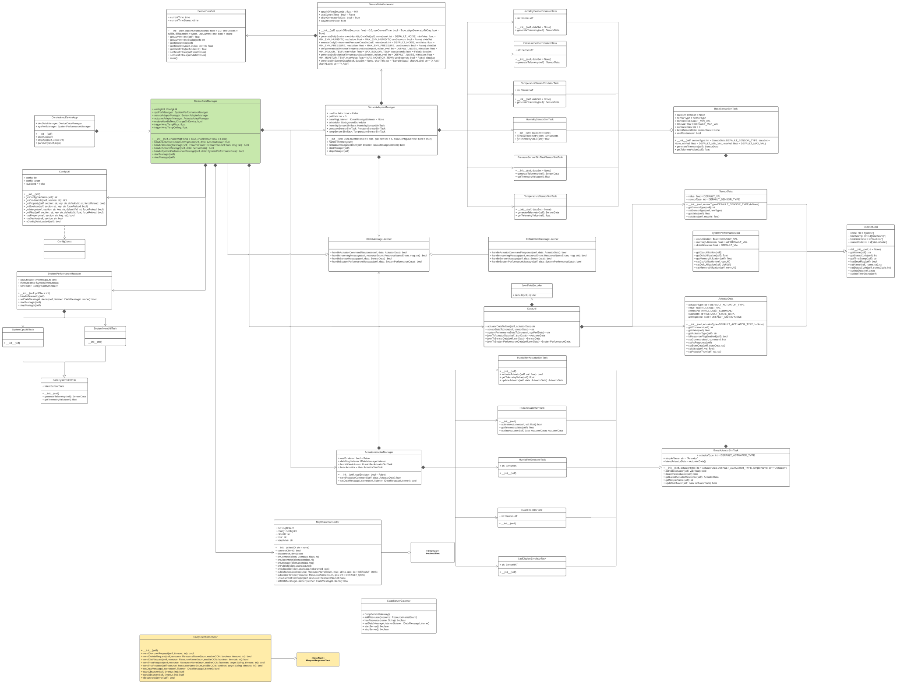

# Constrained Device Application (Connected Devices)

## Lab Module 12 - Semester Project - CDA Components

### Description

NOTE: Include two full paragraphs describing your implementation approach by answering the questions listed below.

It is a Constrained Device application of a fire alarming system, it connects GDA with Mqtt protocol.

The CDA can:
	1. Get sensor data from an senceHat emulator/simulator
	2. Trigger Screen actuator with 3 kinds of sensor data
	3. Send picture to GDA
	4. Judge temperature and trigger screen locally

### Code Repository and Branch

URL: https://github.com/NU-CSYE6530-Fall2020/constrained-device-app-Zhengrui-Liu/tree/chapter12

### UML Design Diagram(s)

### Unit Tests Executed

- piot-python-components/src/test/python/programmingtheiot/part01/unit/common/all
- poit-python-components/src/test/python/programmingtheiot/part01/unit/system/all
- poit-python-components/src/test/python/programmingtheiot/part02/unit/data/all
- poit-python-components/src/test/python/programmingtheiot/part02/unit/sim/all
- poit-python-components/src/test/python/programmingtheiot/part03/unit/all

### Integration Tests Executed

- poit-python-components/src/test/python/programmingtheiot/part01/integration/app/all
- poit-python-components/src/test/python/programmingtheiot/part01/integration/system/all
- poit-python-components/src/test/python/programmingtheiot/part02/integration/app/all
- poit-python-components/src/test/python/programmingtheiot/part02/integration/system/all
- poit-python-components/src/test/python/programmingtheiot/part02/integration/emulated/all
- poit-python-components/src/test/python/programmingtheiot/part02/integration/data/all
- poit-python-components/src/test/python/programmingtheiot/part03/integration/app/all
- poit-python-components/src/test/python/programmingtheiot/part03/integration/connection/all

